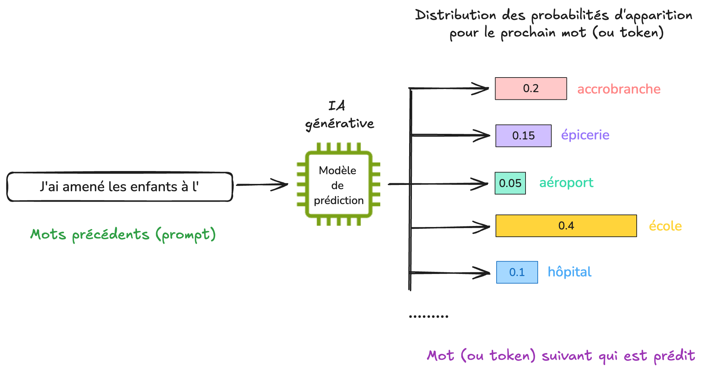
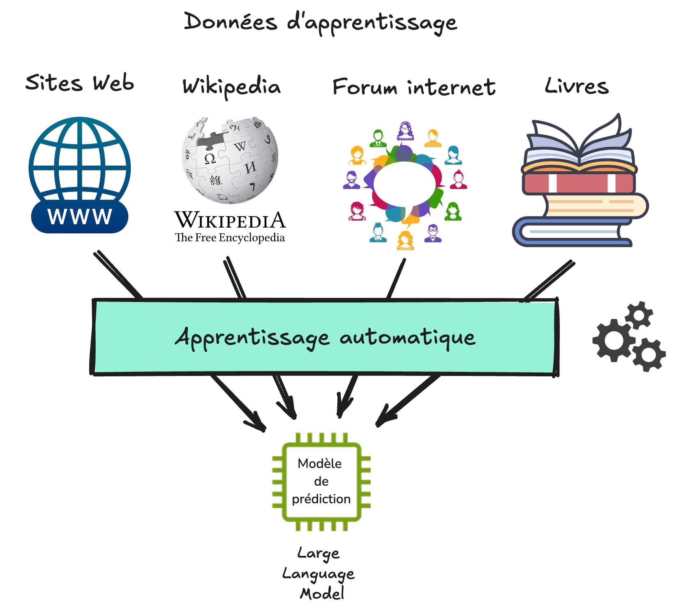
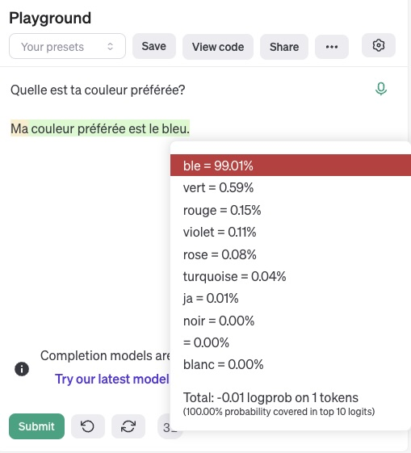
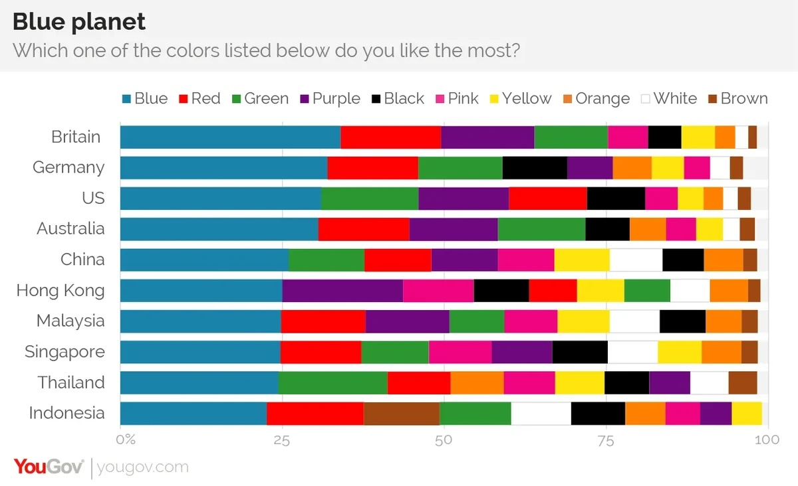

(part3)=
# Fonctionnement de l'IA générative

## Exercice d'échauffement 

Pour bien comprendre le fonctionnement de l'IA générative, nous t'invitons à faire ce petit jeu dans un premier temps. Il suffit de compléter les phrases selon ce qui te semble être la réponse correcte.

<iframe src="https://ladigitale.dev/digiquiz/q/675c015dc823b" allow="fullscreen; autoplay;" frameborder="0" width="100%" height="500"></iframe>
Lors de cet exercice, tu as répondu sur base de ce que tu pensais être le plus probable. Note que :

- pour certaines questions, les réponses ont fait appel à des connaissances que tu as pu acquérir grâce à ta culture ou tes apprentissages, comme peut-être pour l'histoire du Petit Chaperon rouge, ou le nom de la capitale de la France;
- pour d'autre questions, tu n'avais aucun moyen de savoir la réponse de façon certaine. Comment aurais-tu pu deviner que les enfants ont été amenés à l'accrobranche et non à l'école ? Le premier lieu qui nous vient en tête est généralement celui-là. Mais ce n'est pas forcément parce que c'est la réponse la plus probable que cette réponse est vraie;
- enfin, il était impossible de répondre correctement à la phrase sur Bali puisque [Bali n'est pas une capitale](https://fr.wikipedia.org/wiki/Bali).

Lorsque plusieurs choix sont possibles pour une réponse et que l'on choisit celui qui nous semble le plus probable (sans garantie que ce choix soit correct ou juste), on dit que l'on répond **de manière probabiliste**.
## IA générative et auto-complétion

L'IA générative fonctionne selon le même principe que l'exercice que tu viens de faire. 

Au coeur d'une IA générative se trouve un modèle de prédiction qui a été entrainé pour une tâche très simple : prédire le mot suivant étant donné un début de texte (le prompt).

**Note**: En réalité, ce n'est pas toujours un mot complet qui est prédit, il peut s'agir parfois d'une partie de mot (lettres, ou syllabes), que l'on appelle **token** (ou jeton en français). Pour simplifier, on utilisera ici des exemples ou ce sont des mots entiers qui sont prédits.

Comme différentes possibilités de mots sont en général possible, le modèle de prédiction attribue pour chaque mot une probabilité d'apparition.

Avec un début de phrase comme "J'ai amené les enfants à l'", le modèle de prédiction pourrait par exemple considérer des options parmi des mots comme "accrobranche", "épicerie", "aéroport", "école", "hôpital", etc. Le mot école pourrait avoir la probabilité la plus importante d'apparaître, et des possibilités comme "aéroport" ou "hôpital" des probabilités moins importantes.

Le modèle tire au sort l'une des possibilités et renvoie le mot à l'utilisateur. 

Tu as peut-être remarqué que les chatbots d'IA générative affichent les mots les uns à la suite des autres lorsqu'il répondent. La raison est tout simplement car les mots sont prédits les uns après les autres, comme si tu acceptais automatiquement les propositions faites par le système d'auto-complétion de ton téléphone. 

A la différence de l'auto-complétion du téléphone, un modèle de prédiction comme GPT-4 (qui se cache derrière un outil comme Microsoft Copilot ou ChatGPT) a été entraîné sur d'**énormes** quantités de données, et nécessite généralement du matériel informatique spécialisé dont le coût environnemental n'est pas négligeable.  

Si tu veux en savoir un peu plus sur le fonctionnement, nous te conseillons [cette vidéo](https://www.youtube.com/watch?v=7ell8KEbhJo&t=848s) (à partir de 14:08 pour d'autres exemples de génération).
## Données d'apprentissage et modèle de langage

Mais comment le modèle de prédiction est-il capable de prédire le prochain mot ?

Un peu comme nous en fait, dans le premier exercice. Son savoir a été acquis lors d'une phase que l'on appelle apprentissage, au cours de laquelle de nombreux exemples de textes lui ont été montrés.

Les exemples donnés au modèle de prédiction lors de la phase d'apprentissage constituent ce que l'on appelle les **données d'apprentissage**. Pour l'entraînement d'une IA générative de texte, ces exemples proviennent principalement d'Internet, come des sites Web, Wikipedia, les forums ou certains réseaux sociaux, mais également des livres ou des journaux.

Pour que le modèle de prédiction puisse apprendre à prédire le mot suivant sur la base de ces données d'apprentissage, des techniques **d'apprentissage automatique  (ou "machine learning" en anglais)** sont utilisées. Dans le cas de la prédiction de texte, le modèle de prédiction est parfois appelé **modèle de langage**, car il correspond à une représentation imparfaite (un modèle) du langage. Un terme couramment employé est celui de **LLM**  (pour Large Language Model en anglais).

Les données d'entraînement jouent un rôle très important, car ce sont elles qui déterminent ce que le modèle de langage pourra ou ne pourra pas faire. 

Les organisations qui développent des modèle de langage doivent ainsi déterminer quelles données d'entraînement inclure, comme par exemple des données provenant de différentes langues pour pouvoir faire de la traduction, ou des exemples de programmes informatiques pour pouvoir ensuite générer du code.

Elles doivent aussi décider de ce qui ne doit pas être inclus, comme des données protégées par la propriété intellectuelle, des fausses informations, ou des contenus haineux ou discriminants, afin que ceux-ci ne soient pas reproduits par le LLM. 

**Note** : La question de ce qu'il est souhaitable et/ou permis d'inclure dans les données d'apprentissage d'un modèle de langage est complexe, et dépend de valeurs morales et de cadres juridiques qui peuvent varier en fonction des lieux et des cultures.

La phase d'entraînement d'une IA générative est en général très longue et très coûteuse, et ne peut être réalisée que par de grandes organisations. Pour les gros modèles de langages, ce sont des milliards de documents qui sont utilisés pour l'apprentissage. L'entraînement dure parfois plusieurs mois dans des centre de données spécialisés, pour des coûts de plusieurs dizaines de millions d'euros.

Cette longue phase d'apprentissage n'a lieu qu'une fois. Le modèle peut ensuite être utilisé en mode auto-complétion, que l'on appelle aussi l'inférence. 

## Une intelligence artificielle a-t-elle une couleur préférée ?

Demandons-lui !

L'interface [Playground](https://platform.openai.com/playground/complete?model=gpt-3.5-turbo-instruct) d'OpenAI (nécessitant malheureusement un compte payant) permet d'afficher les probabilités associées à chaque mot qui a été prédit par un modèle de langage. Ci-dessous, il s'agit du modèle GPT3.5, qui se cachait derrière l'interface de ChatGPT à ses débuts. 

Le modèle nous répond que sa couleur préférée est le bleu.

En cliquant sur le mot "bleu", on peut voir les autres possibilités qui aurait pu apparaître, comme "vert", "rouge", "violet", etc.

Mais pourquoi donc le bleu a-t-il une probabilité aussi élevée ?

La réponse se trouve en fait chez l'humain. Il se trouve que le bleu semble [être la couleur préférée des humains, à travers de nombreuses cultures](https://today.yougov.com/international/articles/12335-why-blue-worlds-favorite-color).

Ce n'est donc pas l'IA qui a une couleur préférée. Sa réponse reflète simplement ses données d'entraînement, dans lesquelles il se trouve que le bleu est de façon majoritaire la couleur la plus souvent préférée par les humains.

Ceci nous amène au dernier point important sur le fonctionnement des IA génératives. Comme elles reflètent ce que contiennent leurs données d'apprentissage,  elles ne sont pas neutres et contiennent de nombreux **biais**.

Ces biais sont souvent discriminant envers les minorités, notamment concernant les valeurs sur des questions de genres, de cultures ou de religions. 

## A retenir

Il peut sembler magique que les outils IA génératives soient capables de produire des contenus très sophistiqués, parfois similaires à des productions humaines.

Pourtant, le coeur de ces outils repose sur des concepts mathématiques simples issus du domaine des probabilités. Leur fonctionnement est bien éloigné de celui de l'intelligence humaine. Il se rapproche plutôt de celui d'un outil d'auto-complétion automatique qui suggère d'ajouter les mots ou syllabes les plus probables.

Les réponses sont créées à la volée, sans planification ni raisonnement.

Ceci explique pourquoi :

- Pour une même question, les réponses générées par un LLM sont différentes à chaque fois.
- Les LLMs n'ont pas de capacité de raisonnement, ni de notion de ce qui est vrai ou faux. 
- Si un modèle a commencé à générer une réponse contenant des faits ou des raisonnements erronés, il lui sera difficile de les corriger par la suite.
- Les IA génératives ne sont pas neutres. Au contraire, elles ne font que refléter leurs données d'entraînement, et contiennent ainsi de nombreux biais.

## Vocabulaire utile

* **Auto-complétion**, ou complétion de mots : L'auto-complétion est une fonction qui permet à une application de prédire la suite d'un mot que l'utilisateur est en train de taper ([Wikipedia](https://fr.wikipedia.org/wiki/Auto-compl%C3%A9tion)).
* **Modèle de langage** : Modèle probabiliste de la distribution de symboles distincts (lettres, phonèmes, mots) dans une [langue naturelle](https://fr.wikipedia.org/wiki/Langage_naturel "Langage naturel") ([Wikipedia](https://fr.wikipedia.org/wiki/Mod%C3%A8le_de_langage)).
* **Données d'entraînement** : Données d'exemples utilisés pour ajuster les paramètres (par exemple, les poids des connexions entre les neurones dans [les réseaux de neurones artificiels](https://fr.wikipedia.org/wiki/R%C3%A9seau_de_neurones_artificiels "Réseau de neurones artificiels") ) d'un modèle de prédiction ([Wikipedia](https://fr.wikipedia.org/wiki/Jeux_d%27entrainement,_de_validation_et_de_test)).
* **Biais dans les larges modèles de langage** : Préjugés et stéréotypes que peuvent refléter les modèles de langage du fait de la partialité des données d'entraînements choisies par les équipes qui préparent et conçoivent les modèles de langage ([Wikipedia](https://fr.wikipedia.org/wiki/Grand_mod%C3%A8le_de_langage#Biais_et_limites)).
## Ressources

- [Comment fonctionne ChatGPT? Un tour d’horizon en moins de 5mn](https://www.youtube.com/watch?v=K8gOvC8gvB4) - Vidéo réalisée par l’équipe Flowers du centre Inria de l'Université de Bordeaux ([https://flowers.inria.fr/](https://www.youtube.com/redirect?event=video_description&redir_token=QUFFLUhqbURVN0dtZHFBbG5yRUg3NDU2RF90aVZBS25NQXxBQ3Jtc0ttaTAzVDFJX2RiZ19uME40dlNOamxaQzk2LXRmOHBidmZ3aGJ2cXlCOXZlRUtqVVpJNmt2bE9wUkhaZE1BcEtubWM5alNIcmR1ZmloU3NTRXB0NVp1YmFHTnp5Y0Y1VFdmWUpJN3BreG5XYjMySnZTWQ&q=https%3A%2F%2Fflowers.inria.fr%2F&v=K8gOvC8gvB4) ). 
