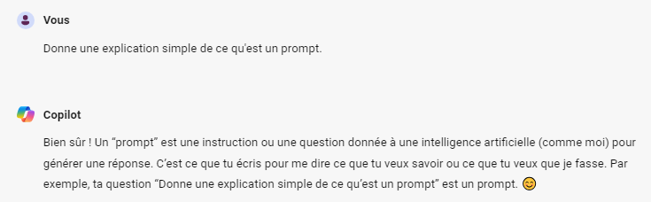
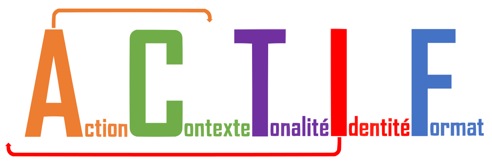

# Améliorer ses prompts
## Qu'est-ce qu'un prompt?

Le prompt est l'ensemble des instructions que l'on donne à l'outil d'IA générative pour accomplir une tâche.

La qualité du résultat que produira un outil d'IA générative dépendra en partie de la façon dont le prompt est formulé. 

Par exemple, si tu demandes à un outil d'IA générative de fournir des idées pour ta prochaine présentation, tu auras peu de chance d'avoir des résultats pertinents si tu ne donnes pas d'informations supplémentaires sur l'objectif de la présentation, un état de l'art des solutions existantes, les perspectives que tu souhaites apporter, tes contraintes, etc.

## Comment rédiger un bon prompt avec la méthode ACTIF ?

D'une manière générale, il est souvent souhaitable de préciser dans un prompt chacun de ces cinq éléments: Action, Contexte, Tonalité, Identité, Format. 

C'est le modèle ACTIF. (Idéalement indiqué dans le prompt selon cet ordre : ICATF, comme le montre le logo du modèle).

Pour avoir accès aux informations, clique sur les flèches et sur les + de ce schéma (ou clique sur la petite main en haut à droite pour découvrir les éléments cliquables de ce genially).

    
<iframe title="Zentrales Schema Mindmap" frameborder="0" width="1200" height="675" style="text-align: center; position: absolute; top: 0px; left: 0px; width: 100%; height: 100%;" src="https://view.genially.com/672a139461d8c8b0919da0c0" type="text/html" allowscriptaccess="always" allowfullscreen="true" scrolling="yes" allownetworking="all"></iframe> 

[Cliquer ici pour tester la création de prompt avec la méthode ACTIF](https://actif.numedu.org/).

[Cliquer ici pour des exemples d'usages](https://prompting.numedu.org/browse.php?cible=apprenants).

## Comment améliorer la réponse de l'IA avec la méthode APRES ?

Tu as réalisé un super prompt mais la réponse de l'IA n'est pas à la hauteur de tes attentes ? Tu peux toujours améliorer le contenu qu'elle t'a rédigé en utilisant la méthode "après".

L'IA fonctionne de la même manière qu'une conversation. Tu peux donc améliorer sa production en lui fournissant un feedback dans la conversation, sans devoir recommencer un nouveau prompt. Cette technique permet de partir d'une première production de l'IA et de l'améliorer au fur et à mesure selon tes attentes.

    
<iframe title="Modèle APRES" frameborder="0" width="1200" height="675" style="text-align: center; position: absolute; top: 0px; left: 0px; width: 100%; height: 100%;" src="https://view.genially.com/6751a9334169a02fd9d77548" type="text/html" allowscriptaccess="always" allowfullscreen="true" scrolling="yes" allownetworking="all"></iframe> 

