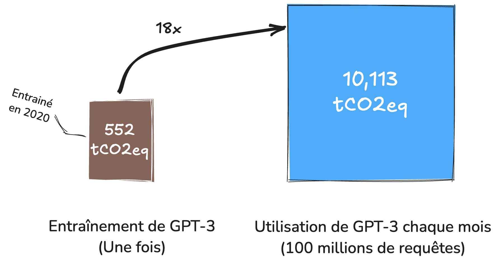
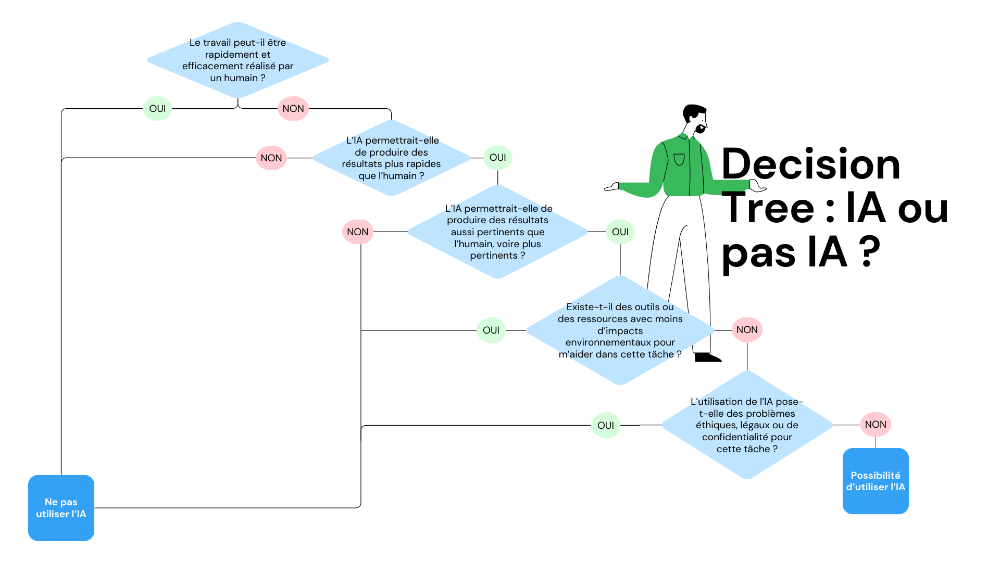

# Points de vigilance
## Les outils d'IA générative ne sont pas des moteurs de recherche

Ils ne sont pas conçus pour fournir des résultats fiables et cohérents. Comme présenté dans la section "Fonctionnement de l'IA générative", ce sont des outils d'auto-complétion conçus pour produire des contenus statistiquement probables. 

Ces outils peuvent donc inventer des contenus, se contredire, ou produire des contenus incohérents ou bizarres.

Par exemple, ils peuvent :

- retourner des réponses différentes pour un même prompt. Les réponses à une question peuvent même se contredire. La cause est l'aspect probabiliste dans la génération de la réponse.
- sembler avoir des opinions, des préférences ou des goûts (comme par exemple préférer la couleur bleue). Ceux-ci ne sont que le reflet des biais présents dans les données d'entraînement. 
- donner de meilleures réponses lorsque l'on demande de réfléchir étape par étape (ou [de respirer un grand coup](https://arstechnica.com/information-technology/2023/09/telling-ai-model-to-take-a-deep-breath-causes-math-scores-to-soar-in-study/ "de respirer un grand coup")). Ceci est une conséquence de l'auto-complétion, par laquelle l'IA générative va tenter de prédire une procédure de résolution qu'elle pourra ensuite prendre en compte pour prédire une réponse.

Plutôt que des outils de recherche d'information, ce sont surtout de bons alliés pour des activités d'exploration d'idées (tout en prenant garde à leurs biais) ou de reformulation.

## Fiabilité des informations produites par l'IA

L'IA peut commettre des erreurs et des hallucinations lorsqu'elle produit du contenu. Pour bien comprendre cela, nous t'invitons à lire la section sur le fonctionnement de l'IA :  "[Fonctionnement de l'IA générative](https://uv.ulb.ac.be/course/view.php?id=127533&section=2)".

Voici des exemples d'incohérences et d'erreurs provenant d'outils d'IA :

    
<iframe title="Présentation des formes basiques" frameborder="0" width="1200" height="675" style="position: absolute; top: 0; left: 0; width: 100%; height: 100%;" src="https://view.genially.com/675aa6b651a0827adad068f3" type="text/html" allowscriptaccess="always" allowfullscreen="true" scrolling="yes" allownetworking="all"></iframe> 

Cela montre bien que même si les intelligences artificielles peuvent nous aider dans notre pratique professionnelle, il faut toujours vérifier si les informations qu'elles nous transmettent ne sont pas erronées ou biaisées.

Il faut garder à l'esprit que lorsqu'on utilise une IA, nous restons responsables du travail qui est généré si nous décidons de l'utiliser sans le retravailler et sans vérifier la véracité des informations. 

Ces biais et ces erreurs peuvent avoir de graves conséquences. C'est pourquoi le contrôle humain reste essentiel lors de leurs utilisations.

## Propriété intellectuelle, plagiat, et protection des données

Tout comme les réseaux sociaux ou internet en général, les contenus partagés dans une requête faite à un outil d'IA générative ne sont généralement pas confidentiels par défaut. En absence de la connaissance approfondie des conditions d’utilisation, **une information transmise à un outil d'IA générative doit être considérée comme publique**. 

En outre, deux points de vigilance spécifiques aux IA génératives doivent être considérés:

1. Souvent, on ne sait pas quelles sont les données d'entrainement d'un modèle, qui peut reproduire des verbatim de contenus protégés. Il est essentiel de toujours remonter aux source primaires, et de **ne pas copier-coller** les réponses fournies par un outil d'IA générative sous peine de pouvoir être accusé de non respect de droit d'auteur ou de plagiat.
2. Inversement, il faut faire attention à toutes les informations que l'on communique dans un chatbot. Les données peuvent servir à l'entrainement. Si celle-ci se retrouvent incluses dans l'entrainement d'un modèle, elle seront quasiment impossible à retirer par la suite. 

Le **droit à l'oubli est rendu encore plus difficile à appliquer avec les outils d'IA génératives**. Alors que dans les cas d'Internet ou d'un réseau social, il est possible de faire la demande à un site, un moteur de recherche ou un réseau social de retirer un contenu spécifique, il est techniquement quasiment impossible d'enlever une information spécifique d'un modèle d'IA générative sans en refaire l'entraînement.
## Les outils d'IA générative ne sont ni neutres ni objectifs

Leurs productions sont le reflet de leurs données d'entraînement. On retrouve ainsi souvent de nombreux biais liés au genre ou aux origines, qui sont le reflet de biais présents dans les données. En effet, les outils d'IA les plus utilisés actuellement sont conçus par des travailleurs occidentaux, majoritairement masculins et des biais culturels et des biais de genre ressortent suite à cela. 

Il n'est pas toujours possible, ni d'ailleurs nécessairement souhaitable, de retirer les biais d'un outil d'IA générative. Les valeurs morales diffèrent en fonction des individus et des cultures. De même qu'il existe des journaux, des partis, ou des communautés exprimant différents opinions, il est tout aussi souhaitable qu'il existe une diversité d'outils d'IA génératives représentatives de différents systèmes de valeurs. 

En ce sens, le développement d'outils et de modèles d'IA générative open-source est essentiel.

    
<iframe title="Présentation des formes basiques" frameborder="0" width="1200" height="675" style="position: absolute; top: 0; left: 0; width: 100%; height: 100%;" src="https://view.genially.com/674b7de2593768b5f5a5074c" type="text/html" allowscriptaccess="always" allowfullscreen="true" scrolling="yes" allownetworking="all"></iframe> 

### Impact environnemental

Les outils d'IA générative sont particulièrement gourmands en ressources informatiques. C'est d'ailleurs pour cela que les meilleurs modèles ne sont disponibles qu'en ligne: Ils demandent trop de mémoire et de puissance de calcul pour pouvoir fonctionner sur un laptop ou un smartphone. 

L'impact environnemental est multiple. Il y a un impact du point de vue de la consommation d'énergie pour faire les calculs permettant faire fonctionner ces outils. Ici, il y a deux grandes étapes. La première est l'entraînement d'un modèle, très coûteuse en calcul, mais qui n'est réalisée qu'une fois. La seconde est l'utilisation du modèle, c'est à dire à chaque fois qu'un utilisateur a une interaction avec le modèle. Celle-ci est beaucoup moins coûteuse en énergie, mais au final plus importante que la première si le modèle est utilisé par des millions d'utilisateurs.

Ces tonnes d'équivalent CO2 de pollution environnementale (tCO2eq) peuvent être assez abstraites. 

Pour les comparer à des activités plus tangibles, ce sont chaque mois des dizaines de milliers d'allers-retours en avion entre Paris-New York. **C'est l'utilisation plus que l'entraînement de ces modèles qui a le plus gros impact environnemental, du fait des millions d'utilisateurs**.

Et plus concrètement encore, quel est le coût environnemental d'une requête GPT par rapport à une recherche Google, ou regarder Netflix?

La question est assez complexe, et dépend de beaucoup de paramètres comme le type de modèle utilisé, la longueur de la question et de la réponse, et les sources d'énergie utilisées.

Mais voici quelques ordres de grandeurs utiles à avoir à l'esprit:

- Une recherche sur un outil d'IA générative simple (type GPT-3) est considérée comme **6 à 10 fois plus coûteuse en énergie** qu'une recherche Internet type Google [1](https://huggingface.co/blog/sasha/ai-environment-primer "1").
- Un échange avec un modèle simple type GPT-3 a un impact équivalent à 2g de CO2, soit environ 30 minutes d'éclairage avec une ampoule LED, ou à **environ 3 minutes de vidéo en ligne** [2](https://www.comparia.beta.gouv.fr/ "2").

Au delà du coût en énergie pour entraîner et faire fonctionner les modèles d'IA générative, n'oublions pas que cela nécessite de puissants ordinateurs, et donc des matières premières mais aussi à nouveau de l'énergie et également beaucoup d'eau pour construire et faire fonctionner toutes ces machines. Pour en savoir plus sur le sujet, nous t'invitons à regarder cette vidéo.

Au delà du coût en énergie pour entraîner et faire fonctionner les modèles d'IA générative, n'oublions pas que cela nécessite de puissants ordinateurs, et donc des matières premières mais aussi à nouveau de l'énergie et également beaucoup d'eau pour construire et faire fonctionner toutes ces machines. Pour en savoir plus sur le sujet, nous t'invitons à regarder cette vidéo.

<iframe width="560" height="315" src="https://www.youtube.com/embed/kaZ6zTwVncw" title="YouTube video player" frameborder="0" allow="accelerometer; autoplay; clipboard-write; encrypted-media; gyroscope; picture-in-picture" allowfullscreen></iframe>
##### Pistes pour limiter l'impact environnemental de l'IA

- **Optimisation des requêtes** : Formuler des requêtes précises et concises pour réduire le temps de calcul et la consommation d'énergie. Cela permet d'éviter de multiplier les prompts, et par la même occasion, la génération de réponse par l'IA.
- **Utiliser des modèles moins coûteux en énergi****e** : plus un modèle est entraîné sur des données nombreuses, plus la génération est coûteuse en énergie. Utiliser des IA avec des modèles moins avancés pour des tâches plus simples peut permettre de réduire l'impact environnemental.
- **Utilisation responsable** : Limiter l'utilisation des outils d'IA générative aux besoins essentiels et éviter les usages superflus qui consomment des ressources inutilement. Garder des moments de réflexion déconnectée. Pour t'aider à déterminer si une tâche nécessite vraiment l'IA ou non, tu peux suivre cet organigramme de décision :

