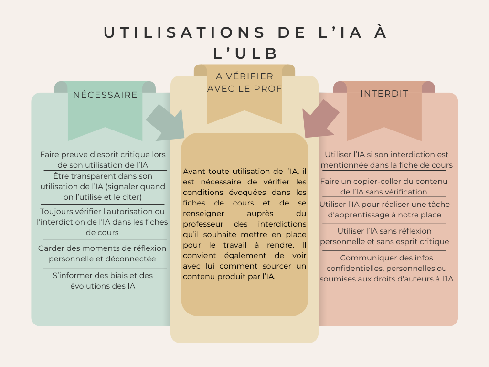

# Principes d'utilisation à l'ULB

## Qu’est-ce qui est considéré comme une fraude ?

- La réalisation avec l'IA d’une tâche sur laquelle porte une évaluation (sauf si autorisation explicite dans la fiche de cours ou dans les consignes d’évaluation)
    - Le [règlement général des études de l'ULB](https://www.ulb.be/fr/documents-officiels/reglement-general-des-etudes-2024-2025) précise que l'IA générative ne doit pas être utilisée pour effectuer une tâche d'apprentissage. Par exemple, et sauf indication contraire du professeur, il est autorisé d'utiliser l'IA générative pour traduire le texte d'un article scientifique de l'anglais vers le français afin d'en comprendre le contenu. A l'inverse, il est interdit d'utiliser l'IA en tant que traducteur si la traduction de ce texte fait l'objet d'une évaluation dans le cadre d'un cours de langue.
- Masquer ou dissimuler son utilisation de l’IA

**Conséquences des fraudes – Article 83 du RGE (« Plagiat et sanctions »)**

- Une sanction académique dépendant de la gravité de la fraude. Cela peut aller jusqu’à l’attribution d’une note de 0/20 à l’épreuve évaluée.
- Des sanctions disciplinaires sont également applicables en plus de la sanction académique du RGE (ex : réprimande, obligation de valider une formation complémentaire, suspension temporaire, interdiction d’accès à la période d’examens en cours, exclusion …)

## Outils recommandés

- Microsoft Copilot: Seul outil couvert par un contrat de licence avec l'ULB, protégeant ainsi les données et les conversations des utilisateurs
- HuggingChat
- Outils open-source utilisés sur sa machine, tel que LMStudio, Ollama.  

En savoir plus sur les outils : [ici](https://uv.ulb.ac.be/course/view.php?id=127533&section=6). 

## Autres points d'attention

**Modalités d'utilisation dépendent de chaque cours**: Vérifiez toujours avec vos enseignant.e.s les modalités d'utilisation des IA génératives.

**Transparence**. Bien qu'il soit impossible de retracer l'origine des textes produits par les outils d'intelligence artificielle à large modèle de langage (LLM), leur usage, dans la mesure où il n'est pas une production originale de votre part, doit toujours être signalé. [VI - E - 1 - What's up Doc](https://uv.ulb.ac.be/mod/book/view.php?id=492082&chapterid=22010). Le recours non référencé à une intelligence artificielle est considéré comme une fraude académique ou scientifique. A ce titre, dans le cadre de l'enseignement, elle est soumise à sanction fixée par le [Règlement général des études, articles 40 et 83](https://www.ulb.be/fr/documents-officiels/reglement-general-des-etudes-2024-2025)).  [VI -H -1 What's Up Doc](https://uv.ulb.ac.be/mod/book/view.php?id=492785&chapterid=22037).

**Attention au plagiat involontaire !** Les LLMs peuvent générer des verbatim de contenus existants et reprendre des contenus protégés par des droits d’auteur. Ne copiez-collez jamais tel quel la production d'un LLM, et cherchez et référencez toujours les sources originales.

**Erreurs, biais et incohérences**. Les LLM peuvent très facilement contenir des erreurs factuelles, des biais idéologiques ou des incohérences.

**Originalité**. Les travaux que vous proposez doivent être issus d'une réflexion personnelle. 

## Citation d'une production issue d'une Intelligence Artificielle (IA)

On peut suivre le schéma suivant, inspiré du style APA, pour renseigner les productions faites par une Intelligence Artificielle, comme par exemple ChatGPT. Certains systèmes de référencement demandent de renseigner le type d'intelligence artificielle utilisé (à indiquer juste après le prompt/question que vous avez lancé.e). [VI - F - 3 - What's up Doc](https://uv.ulb.ac.be/mod/book/view.php?id=492137&chapterid=22027)

**Nom du producteur de l'Intelligence Artificielle. (Année de consultation). _Nom de l'Intelligence Artificielle_ (date de consultation). [prompt/question utilisé.e]. Disponible sur Internet à l’adresse : https://…**

Exemple :

Open AI. (2024). _ChatGPT_ (04 juillet 2024). [Trouve moi un exemple de référence de ChatGPT]. Disponible sur Internet à l’adresse : https://www.exemple.be
## Règlements

Les dispositions relatives aux principes d'utilisation de l'IA générative dans les enseignements à l'ULB sont définis dans:

- [l'article 40 et l'article 83 du RGE](https://www.ulb.be/fr/documents-officiels/reglement-general-des-etudes)
- [la note d’Intention Relative aux Outils d'Intelligence Artificielle dans l'Enseignement à l’ULB. Conseil académique du 26 février 2024 – Annexe n° 060ter](https://www.ulb.be/fr/intelligence-artificielle/note-dintention-relative-aux-outils-dia-dans-lenseignement-a-lulb)
- [Règlement de la Commission de discipline relative aux étudiants](https://portail.ulb.be/fr/documents-officiels/instances-participatives/autres-instances-participatives/reglement-de-la-commission-de-discipline-relative-aux-etudiants?ksession=13a71232-da6b-4171-a6ea-5e1054877863)  
- [Les dispositions facultaires complémentaires et les fiches de cours](https://www.ulb.be/fr/documents-officiels/reglement-general-des-etudes-2024-2025)
