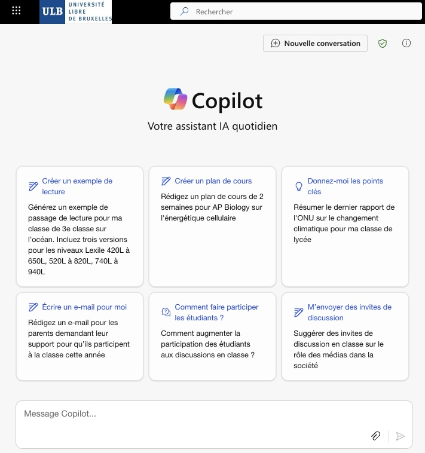
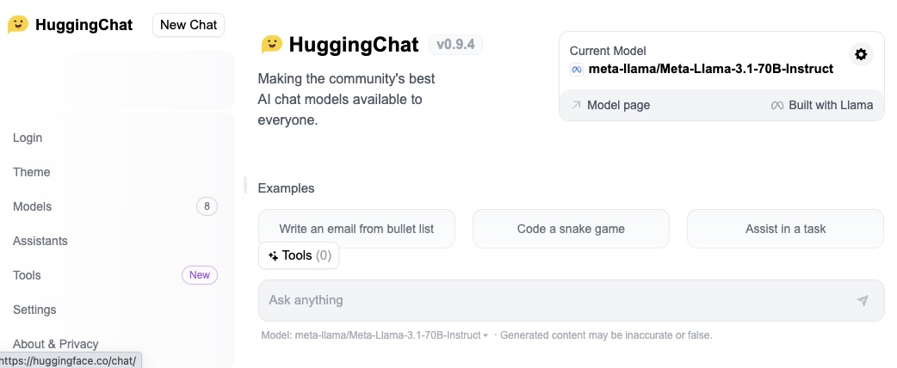

# Boîte à outils de référence

## Microsoft copilot

[Copilot](https://copilot.cloud.microsoft/) est le chatbot de Microsoft. C’est un robot qui dispose, entre autres, des modèles GPT4-Turbo et DALL-E 3 à l’instar de ChatGPT.

Inclus automatiquement dans les licences Microsoft, son usage est couvert par le contrat qui lie Microsoft à l’ULB et **garantit la confidentialité et la propriété des données** transmises à ou produites par l’outil. **C’est le seul outil qui offre actuellement ce niveau de sécurité juridique à l’Université**. 

**Testez-le!**

- Rendez-vous sur [https://copilot.cloud.microsoft/](https://copilot.cloud.microsoft/), et connectez-vous avec votre adresse email ULB. Le logo de l’ULB doit alors apparaître en haut à gauche de l’écran et le logo d’un bouclier vert en haut à droite confirme que vos conversations sont protégées.
## HuggingChat

**[HuggingChat](https://huggingface.co/chat/)** est une interface open-source permettant d'interagir avec différents types de modèles d'IA génératives. L'interface est développée par la société [🤗 HuggingFace](https://fr.wikipedia.org/wiki/Hugging_Face), qui est une start-up (licorne) franco-américaine du domaine de l'Intelligence artificielle créée en 2016 et qui développe des outils pour utiliser l'apprentissage automatique.

Le modèle utilisé est indiqué en haut à droite de l'interface, ou au bas de la conversation. Dans l'image ci-dessus, il s'agit par exemple du modèle 'meta-llama/Meta-Llama-3.1-70B-Instruct'. Sans entrer dans trop de détails, ce nom un peu barbare donne quelques indications sur les concepteurs (ici l'entreprise Meta), la version (3.1), et la taille du modèle (70B, ce qui signifie 70 milliards de paramètres). En pratique, plus la version ou la taille du modèle est élevée, meilleur sera la qualité de la réponse ou du contenu généré, mais plus celui-ci sera coûteux en ressources de calcul et aura un impact environnemental élevé.
  
Notez que l'interface précise que le contenu généré peut être imprécis ou faux, ce qui est toujours le cas avec l'IA générative. Comme nous le verrons un peu plus, ces outils sont conçus pour générer des contenus statistiquement probables, sans notion de véracité ou de raisonnement logique. 

Vous pouvez changer le modèle (lien vers modèle dans la barre de gauche), et comparez la réponse fournie par un autre modèle (plus grand ou plus petit). Qu'observez-vous sur la qualité de la réponse?

**Note sur la protection des données**

HuggingChat permet d'interagir avec les meilleurs modèles d'IA open-source, et fait partie des rares entreprises appliquant le principe du « [Privacy by Design](https://huggingface.co/chat/privacy) ». Les conversations sont privées et ne seront partagées avec personne, y compris les auteurs de modèles, à quelque fin que ce soit, y compris à des fins de recherche ou de formation de modèles.

**Testez-le!**

- Rendez-vous sur [https://huggingface.co/chat](https://huggingface.co/chat)