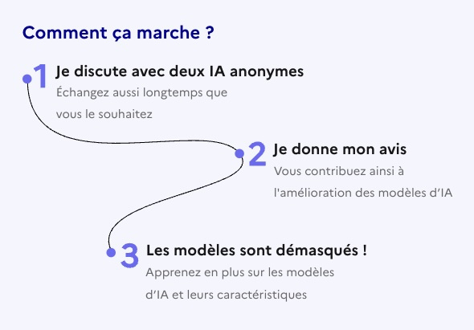

(part9)=
# Aller plus loin

## Comment comparer les outils d'IA générative?

Le site [Compar:IA](https://www.comparia.beta.gouv.fr/), proposé par le service du numérique du ministère de la Culture français, est un outil intéressant pour comparer différents modèles d'IA générative open-source. 

Allez tester et comparer vous même les modèles open-source sur le site. Lequel semble répondre suffisamment bien à vos demandes tout en consommant le moins d'énergie?

## Il était une fois ChatGPT : Brève histoire d'une IA régressive, par Hugues Bersini

Cours-conférence dispensé au Collège Belgique à Bruxelles le 27 mars 2024, par Hugues Bersini, Professeur à l’Université libre de Bruxelles et directeur du Centre d’Intelligence artificielle de l’Université libre de Bruxelles (IRIDIA).

<iframe width="560" height="315" src="https://www.youtube.com/embed/VTRDr1FKCys" title="YouTube video player" frameborder="0" allow="accelerometer; autoplay; clipboard-write; encrypted-media; gyroscope; picture-in-picture" allowfullscreen></iframe>
